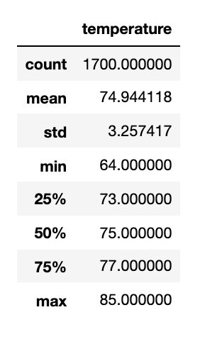
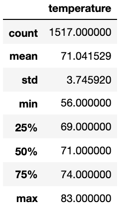

# Surfs Up 

## Overview

This assignment was to use Python, SQLAlchemy and Flask to analyze and visualize climate data as we help someone prepare to open a surf shop. To take it further, we explore temperature data for the months of June and December in Oahu, in order to determine if the surf and ice cream shop business is sustainable year-round.

* Deliverable 1: Determine the Summary Statistics for June
* Deliverable 2: Determine the Summary Statistics for December
* Deliverable 3: A written report for the statistical analysis (README.md)

## Analysis
By running two seperate queries, one being for June and the other being December we can learn more about temperatures year-round. We can then store the temperature information in a list before converting them to a dataframe. As a dataframe we can get summary statistics for the data by using the .describe() method. 

### June
Summary statistics:
* The mean average temperature for June was 74.94 degrees Fahrenheit.
* The lowest recorded temperature was 64, and the max was 85.

### December
Summary statistics:
* The mean for December was 71 degrees Fahrenheit.
* The minimum was 56, and the max was 83.

## Summary
It would seem that the temperatures of the location we focused on would work for a surf and ice cream shop for most days throughout the year, as the standard deviation between these two points is small, at 0.5. 
A few additional queries that we could perform to gather more weather data for June and December that could tell us advanced information for our business venture's projected success would be:
* wind conditions
* precipitation conditions
* high and low tide conditions

These could help us understand the hours we should open our shop, the seasons where there is more rain, and the additional staff we might need during peak surfing season.
